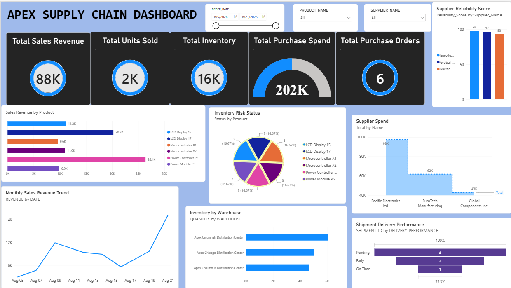

# Apex Electronics Supply Chain Analytics

An end-to-end supply chain analytics project designed to analyze inventory, suppliers, purchase orders, shipments, and sales data using Python, Oracle SQL, Power BI, FastAPI, Docker, GitHub, and Microsoft Azure.

## Project Overview

The goal of this project is to build a centralized analytics workflow that combines data from multiple sources, transforms and analyzes the data, and provides business insights through an interactive Power BI dashboard and REST API.

The project simulates how an electronics company could use data analytics to monitor supply chain performance, identify inventory issues, evaluate suppliers, analyze shipments, and support data-driven decision making.

## Power BI Dashboard

The Power BI dashboard provides interactive analysis of:

* Inventory levels and stock availability
* Supplier performance
* Purchase orders
* Shipment activity
* Sales trends
* Supply chain performance indicators



[Download the Power BI Dashboard (.pbix)](dashboard/Apex_Electronics_Supply_Chain_Dashboard.pbix)

## REST API

A FastAPI REST API was developed to provide programmatic access to supply chain data and analytics.

The API is containerized with Docker and deployed to Microsoft Azure Container Apps.

**Live API:**

https://apex-supply-chain-api.victoriousbay-30735b39.centralus.azurecontainerapps.io

**Interactive Swagger Documentation:**

https://apex-supply-chain-api.victoriousbay-30735b39.centralus.azurecontainerapps.io/docs

Example API endpoints include:

* `/products` — Product information
* `/suppliers` — Supplier information
* `/inventory` — Inventory and inventory risk data
* `/shipments` — Shipment performance data
* `/purchase-orders` — Purchase order information

## Technologies

* **Python** — Data extraction, transformation, cleaning, and analysis
* **Pandas / NumPy** — Data processing and analysis
* **Oracle SQL** — Relational database and structured supply chain data
* **Power BI** — Interactive dashboards and data visualization
* **Excel** — Supplier and business data
* **FastAPI / REST API** — Programmatic data access and application integration
* **Docker** — Application containerization
* **Microsoft Azure Container Apps** — Cloud deployment
* **Git / GitHub** — Version control and project management

## Data Pipeline

```text
Data Sources
     ↓
Python ETL
     ↓
Data Cleaning & Transformation
     ↓
Oracle SQL Database
     ↓
Analytics / CSV Outputs
     ↓
FastAPI REST API
     ↓
Docker Container
     ↓
Microsoft Azure Container Apps
     ↓
Public HTTPS API
```

Power BI is used separately to visualize the supply chain analytics and business performance data.

## Data Sources

The project combines several types of supply chain data, including:

* Supplier information
* Product information
* Warehouse and inventory data
* Purchase orders
* Purchase order items
* Shipments
* Sales orders
* Supplier performance data
* Supplier quality data
* Inventory risk analysis
* Sales analysis

## Database

The Oracle database contains the following core tables:

* `SUPPLIERS`
* `PRODUCTS`
* `WAREHOUSES`
* `INVENTORY`
* `PURCHASE_ORDERS`
* `PURCHASE_ORDER_ITEMS`
* `SHIPMENTS`
* `SALES_ORDERS`

Oracle SQL is used to store and query structured supply chain data before the data is transformed into analytics outputs.

## Docker

The FastAPI application is containerized using Docker.

The Docker container packages the application, Python dependencies, API code, ETL components, and required analytics data so the application can run consistently across environments.

## Azure Deployment

The FastAPI application is deployed to **Microsoft Azure Container Apps**.

The Azure deployment runs the Dockerized API in Azure using the project's Azure-compatible CSV analytics data.

This allows the API to be accessed through a public HTTPS endpoint without requiring direct access to the local Oracle database.

## Project Structure

```text
apex-supply-chain/
│
├── api/
│   └── main.py
│
├── etl/
│
├── data/
│   ├── excel/
│   ├── sharepoint/
│   ├── inventory_risk.csv
│   ├── sales_analysis.csv
│   ├── shipment_performance.csv
│   ├── supplier_excel_analysis.csv
│   ├── supplier_performance.csv
│   ├── supplier_quality_analysis.csv
│   └── supply_chain_summary.csv
│
├── dashboard/
│   ├── Apex_Electronics_Supply_Chain_Dashboard.pbix
│   └── supply-chain-dashboard.png
│
├── Dockerfile
├── requirements.txt
└── README.md
```

## Current Status

* [x] Oracle SQL database designed
* [x] Supply chain data modeled
* [x] Python ETL and analytics workflows developed
* [x] Power BI dashboard completed
* [x] FastAPI REST API developed
* [x] Docker container created
* [x] API tested locally
* [x] Azure-compatible analytics mode implemented
* [x] Azure Container App deployed
* [x] Public HTTPS API verified
* [x] Swagger API documentation verified

## Project Goals

This project demonstrates the use of data engineering, analytics, database management, API development, containerization, and cloud deployment to build an end-to-end supply chain analytics solution.
